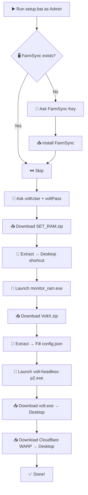

<p align="center">
  <br>
  <h1 align="center">⚡ KAITUN TOOL SUITE</h1>
  <p align="center">
    <strong>One-Click Installer &mdash; Everything you need, one command.</strong>
  </p>
  <p align="center">
    
    
    
  </p>
</p>

---

## 📖 Table of Contents &bull; Mục Lục

| 🇺🇸 English                                      | 🇻🇳 Tiếng Việt                                       |
| ----------------------------------------------- | --------------------------------------------------- |
| [🚀 Quick Start](#-quick-start)                 | [🚀 Bắt Đầu Nhanh](#-bắt-đầu-nhanh)                 |
| [📦 What Gets Installed](#-what-gets-installed) | [📦 Những Gì Được Cài Đặt](#-những-gì-được-cài-đặt) |
| [📁 Repo Structure](#-repo-structure)           | [📁 Cấu Trúc Repo](#-cấu-trúc-repo)                 |
| [📋 Setup Flow](#-setup-flow)                   | [📋 Quy Trình Cài Đặt](#-quy-trình-cài-đặt)         |
| [⚠️ Notes](#️-notes)                             | [⚠️ Ghi Chú](#️-ghi-chú)                             |

---

## 🚀 Quick Start

Open **CMD as Administrator**, paste this single command and press **Enter**:

```cmd
powershell -NoProfile -ExecutionPolicy Bypass -Command "Invoke-WebRequest 'https://raw.githubusercontent.com/TuanDarcy/setup-/main/setup.bat' -OutFile \"$env:TEMP\kaitun-setup.bat\" -UseBasicParsing; Start-Process -FilePath \"$env:TEMP\kaitun-setup.bat\" -Verb RunAs"
```

> That's it. The script handles everything else automatically.

---

## 🚀 Bắt Đầu Nhanh

Mở **CMD với quyền Administrator**, dán lệnh sau và nhấn **Enter**:

```cmd
powershell -NoProfile -ExecutionPolicy Bypass -Command "Invoke-WebRequest 'https://raw.githubusercontent.com/TuanDarcy/setup-/main/setup.bat' -OutFile \"$env:TEMP\kaitun-setup.bat\" -UseBasicParsing; Start-Process -FilePath \"$env:TEMP\kaitun-setup.bat\" -Verb RunAs"
```

> Chỉ vậy thôi. Script sẽ tự động xử lý mọi thứ còn lại.

---

## 📦 What Gets Installed

| #   | Tool                               | Description                                       |
| --- | ---------------------------------- | ------------------------------------------------- |
| 🖥️  | **SET RAM** (`monitor_ram.exe`)    | RAM monitor &mdash; auto-starts on boot           |
| ⚡  | **VoltX** (`volt-headless-p2.exe`) | VoltX headless client &mdash; auto-starts on boot |
| 🔧  | **volt.exe**                       | Volt executable on Desktop                        |
| 🌐  | **Cloudflare WARP** (`1.1.1.1`)    | Secure DNS client on Desktop                      |
| 🔑  | **FarmSync**                       | Optional &mdash; only if you provide a key        |

---

## 📦 Những Gì Được Cài Đặt

| #   | Công Cụ                            | Mô Tả                                                    |
| --- | ---------------------------------- | -------------------------------------------------------- |
| 🖥️  | **SET RAM** (`monitor_ram.exe`)    | Giám sát RAM &mdash; tự động chạy khi khởi động          |
| ⚡  | **VoltX** (`volt-headless-p2.exe`) | VoltX headless client &mdash; tự động chạy khi khởi động |
| 🔧  | **volt.exe**                       | Volt executable trên Desktop                             |
| 🌐  | **Cloudflare WARP** (`1.1.1.1`)    | DNS bảo mật trên Desktop                                 |
| 🔑  | **FarmSync**                       | Tùy chọn &mdash; chỉ cài nếu bạn nhập key                |

---

## 📁 Repo Structure

```
TuanDarcy/setup-/
├── setup.bat              # Main installer script
├── SET_RAM.zip            # SET RAM package (monitor_ram.exe)
├── VoltX.zip              # VoltX package (volt-headless-p2.exe + config.json)
├── volt.exe               # Volt executable
├── Cloudflare_WARP.exe    # 1.1.1.1 WARP installer
└── README.md              # This file
```

---

## 📁 Cấu Trúc Repo

```
TuanDarcy/setup-/
├── setup.bat              # Script cài đặt chính
├── SET_RAM.zip            # Bộ SET RAM (monitor_ram.exe)
├── VoltX.zip              # Bộ VoltX (volt-headless-p2.exe + config.json)
├── volt.exe               # Volt executable
├── Cloudflare_WARP.exe    # Trình cài 1.1.1.1 WARP
└── README.md              # File này
```

---

## 📋 Setup Flow



---

## 📋 Quy Trình Cài Đặt

| Bước  | Chi Tiết                                                      |
| :---: | ------------------------------------------------------------- |
| **1** | Kiểm tra FarmSync &rarr; hỏi key nếu chưa có &rarr; cài đặt   |
| **2** | Hỏi `voltUser` và `voltPass` &rarr; tự điền vào `config.json` |
| **3** | Tải `SET_RAM.zip` &rarr; giải nén vào `Downloads\SET_RAM`     |
|       | &rarr; Tạo shortcut `monitor_ram.exe` trên Desktop            |
|       | &rarr; Thêm vào **Startup** (tự chạy khi boot)                |
|       | &rarr; **Mở chạy ngay** sau cài đặt                           |
| **4** | Tải `VoltX.zip` &rarr; giải nén vào `Downloads\VoltX`         |
|       | &rarr; Tự động điền `voltUser`/`voltPass` vào `config.json`   |
|       | &rarr; Thêm `volt-headless-p2.exe` vào **Startup**            |
|       | &rarr; **Mở chạy ngay** sau cài đặt                           |
| **5** | Tải `volt.exe` về Desktop                                     |
| **6** | Tải `Cloudflare_WARP.exe` (1.1.1.1) về Desktop                |

---

## ⚠️ Notes

- 🔐 **Requires Administrator privileges** to run.
- 📝 `config.json` stores credentials in plain text &mdash; keep this machine private.
- 🔑 FarmSync requires a valid key from your provider.
- 🔄 After setup, **restart your PC** for all startup items to take effect.

---

## ⚠️ Ghi Chú

- 🔐 **Yêu cầu quyền Administrator** để chạy.
- 📝 `config.json` lưu thông tin đăng nhập dạng plain text &mdash; giữ máy riêng tư.
- 🔑 FarmSync yêu cầu key hợp lệ từ nhà cung cấp.
- 🔄 Sau khi cài đặt, **khởi động lại máy** để tất cả mục Startup có hiệu lực.

---

<p align="center">
  <sub>Made with ❤️ for the Kaitun community &bull; <a href="https://github.com/TuanDarcy/setup-">GitHub Repo</a></sub>
</p>
